# SAR Stage-1 Conditioning


**Stage-1 SAR conditioning, denoising, and validation for maritime SAR imagery.**

This repo screens practical SAR conditioning routes between standard SAR product formation and downstream AI. It does **not** claim that denoising always helps. It asks which conditioning route helps which task, under which data domain, and with what evidence.

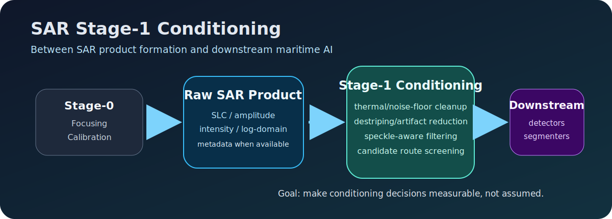

## What Problem Does This Solve?

SAR imagery is noisy in ways that are easy to misunderstand. A ship detector, segmentation model, or object-analysis pipeline may see granular speckle, thermal noise floors, banding, seams, or metadata-dependent calibration artifacts. Removing those effects can improve visual or denoising metrics, but it can also shift the image distribution that a detector learned.

This project turns that ambiguity into a repeatable screening workflow:

- compare raw imagery against four Stage-1 conditioning bundles;
- separate paired denoising metrics from detector compatibility metrics;
- preserve domain labels such as SLC, amplitude, intensity/power, and log-domain;
- avoid operational claims unless a conditioned variant beats raw on the target downstream task.

## Technical Version

The original project brief is a **SAR Stage-1 Conditioning Screening Report for Downstream Semantic Segmentation and Maritime Object Analysis**. Stage-1 sits after focusing/basic calibration and before downstream AI. It uses realistically available product metadata where possible, including calibration/noise vectors, NESZ/noise-floor information, mode/polarization metadata, and image-fitted estimates when metadata is missing.

The implementation covers additive correction, multiplicative speckle handling, complex/SLC future work, paired denoising evaluation, downstream detector compatibility, artifact manifests, and reuse-first execution guards.

## SAR Noise Model

SAR observations are usually better treated as a combined noise problem, not a single generic "bad image" problem.

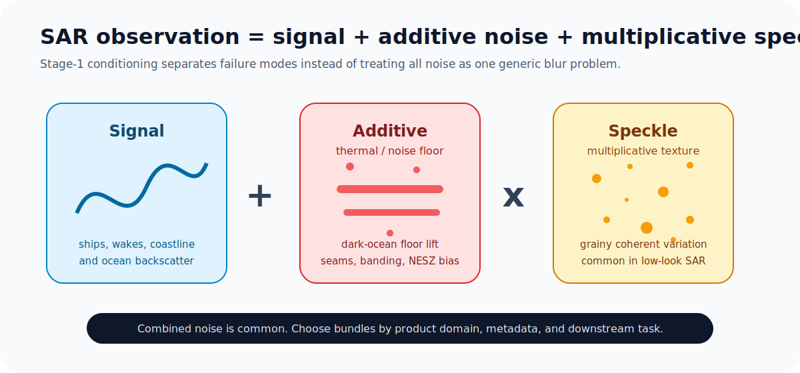

| Noise component | Practical meaning | Typical symptom | Stage-1 response |
| --- | --- | --- | --- |
| Additive thermal/noise floor | Extra energy added to the scene measurement | raised dark ocean floor, seams, banding, product-level bias | metadata/noise-vector subtraction, floor estimation, destriping, PnP/ADMM cleanup |
| Multiplicative speckle | Signal-dependent granular variation from coherent imaging | salt-and-pepper texture, low-look variability | Lee/refined Lee, MuLoG/BM3D-style log-domain despeckling, blind-spot methods |
| Combined noise | Real products can contain both | structured artifacts plus granular speckle | bundle routing by product domain, metadata availability, and downstream task |

Domain labels matter:

- **Complex SLC:** phase-aware complex data; required for serious Bundle C/MERLIN validation.
- **Amplitude:** magnitude-like representation before intensity/power conversion.
- **Intensity/power:** detected imagery common in public chips and GRD-like workflows.
- **Log-domain:** useful for turning multiplicative speckle into a form that Gaussian denoisers can handle more naturally.

## Bundle Overview

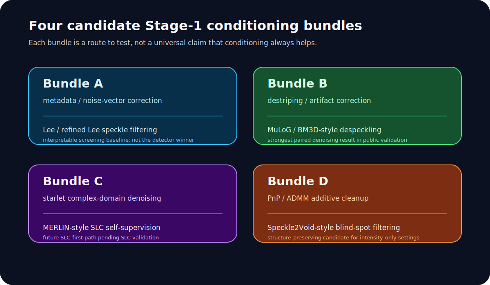

| Bundle | Additive/artifact step | Speckle/self-supervised step | Input domain | Best use case | Current evidence |
| --- | --- | --- | --- | --- | --- |
| Raw | none | none | benchmark/product native | detector baseline and control | best current YOLO mAP on SSDD/HRSID |
| Bundle A | metadata/noise-vector correction, image floor estimate, or structured additive fallback | Lee/refined Lee | intensity / GRD-like | interpretable screening and metadata-aware baseline | improves Mendeley denoising metrics vs raw, but trails raw detector mAP |
| Bundle A conservative | milder A-family correction | milder Lee-style filtering | intensity / GRD-like | lower-risk A-family ablation | improves paired metrics vs raw, still not detector winner |
| Bundle B | destriping / low-rank / artifact-aware correction | MuLoG/BM3D-style log-domain despeckling | intensity / log-intensity | paired denoising quality | strongest current PSNR/SSIM/MSE on Mendeley validation |
| Bundle C | starlet complex denoising | MERLIN-style SLC self-supervision | complex SLC preferred | future SLC-first route | implemented as feasibility path; not fully proven without SLC data |
| Bundle D | PnP/ADMM additive cleanup | Speckle2Void-style blind-spot despeckling | intensity / log-intensity | metadata-poor, mixed, or structure-preserving route | strong SSIM and edge-preservation behavior |

## Submethod Explainer

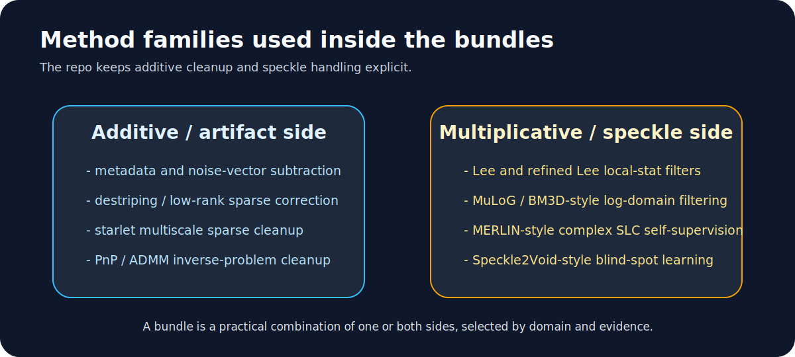

**Metadata/noise-vector subtraction:** subtracts an estimated thermal/noise floor from detected intensity, using product metadata when available. Invalid or negative corrected values are clipped safely rather than treated as real signal.

**Destriping / low-rank / sparse correction:** separates structured row/column artifacts, periodic banding, or seam-like effects from scene content. It is useful when the noise is not random-looking speckle but a visible product artifact.

**Starlet denoising:** uses multiscale sparse shrinkage inspired by astronomy and faint-structure recovery. In this repo it belongs to the complex/SLC-facing path, especially when real and imaginary channels are available.

**PnP/ADMM:** frames denoising as an inverse problem that alternates data consistency with a denoiser prior. It is useful when metadata are weak but the conditioning should stay conservative and structured.

**Lee/refined Lee:** uses local statistics to smooth homogeneous regions while trying to preserve edges. This is the interpretable classical speckle-filtering family used in Bundle A.

**MuLoG/BM3D-style despeckling:** handles multiplicative speckle in a log-domain representation where Gaussian denoisers are more natural. Bundle B uses this family as the main paired denoising route.

**MERLIN:** a complex SLC self-supervised strategy that uses real/imaginary structure rather than clean reference targets. This is a planned Bundle C validation path once genuine SLC data are available.

**Speckle2Void:** a blind-spot self-supervised intensity despeckling idea that predicts pixels from neighboring context. Bundle D uses this family as an intensity-only, metadata-poor candidate.

## Routing Guide

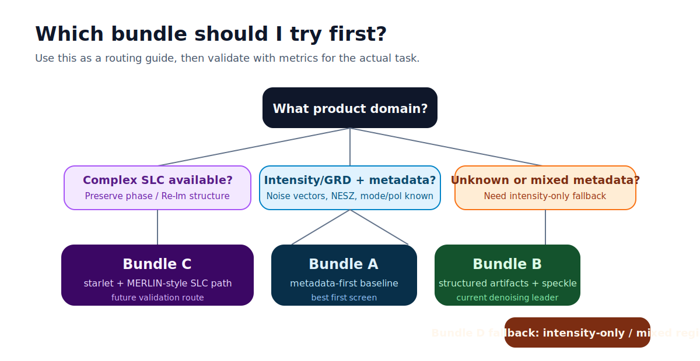

Start with raw as the control. Then choose the first conditioning route by product domain and noise regime:

- use **Bundle C** if genuine complex SLC data are available;
- use **Bundle A** first for intensity/GRD data with credible metadata or noise vectors;
- use **Bundle B** for structured artifacts, striping, banding, and paired denoising quality;
- use **Bundle D** for intensity-only, mixed, unknown, or metadata-poor cases where structure preservation matters.

## Results

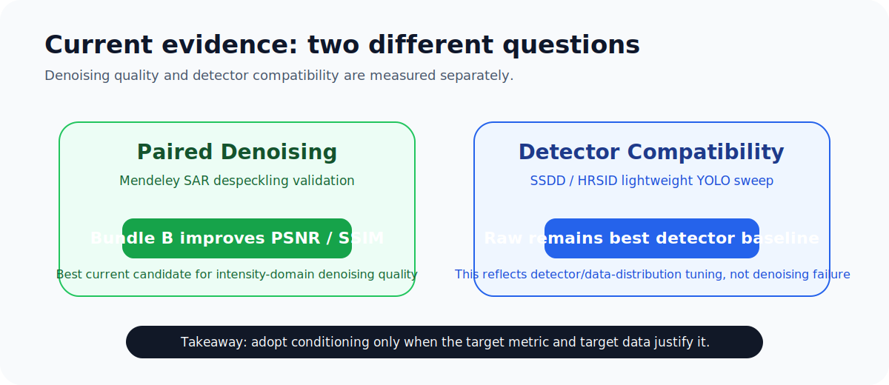

### A. Paired Denoising Quality: Mendeley SAR Despeckling Validation

The Mendeley validation split has 100 matched noisy/reference SAR image pairs. Here, **raw** means the noisy input compared directly against the reference target.

| Variant | Mean PSNR (higher better) | Mean SSIM (higher better) | Mean MSE (lower better) | Mean NRMSE (lower better) | Edge preservation (higher better) |
| --- | ---: | ---: | ---: | ---: | ---: |
| Raw | 18.0782 | 0.5261 | 0.016500 | 0.3256 | 0.5583 |
| Bundle A | 19.4577 | 0.5651 | 0.012262 | 0.2751 | 0.5390 |
| Bundle A conservative | 18.8610 | 0.5544 | 0.013822 | 0.2971 | 0.5647 |
| Bundle B | **20.3082** | **0.5974** | **0.009829** | **0.2513** | **0.5880** |
| Bundle D | 19.4313 | 0.5825 | 0.012149 | 0.2794 | 0.5871 |

<p align="center">
  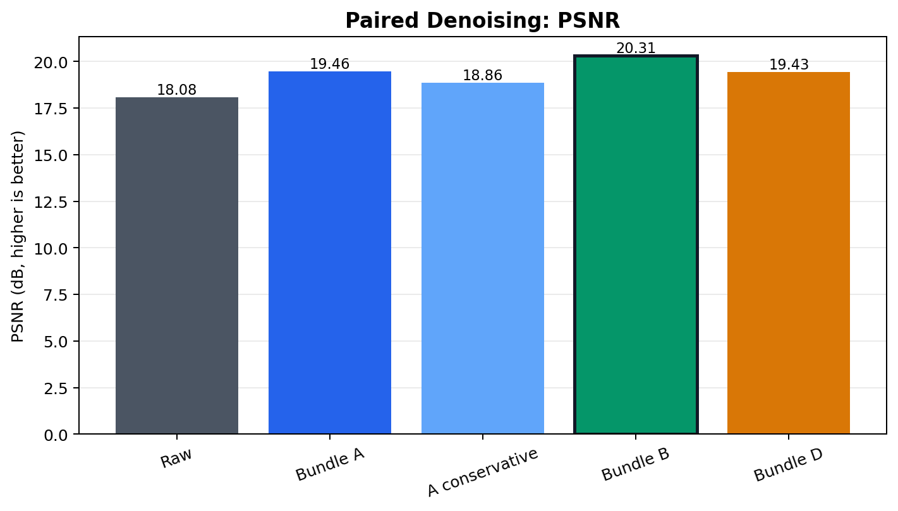
  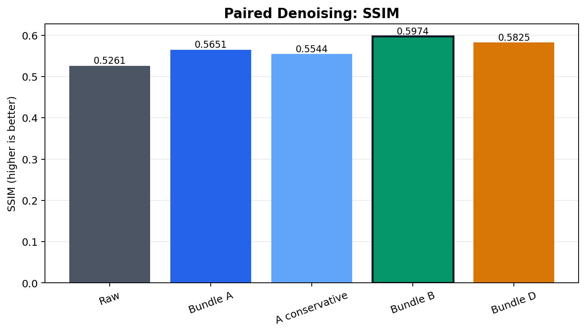
</p>

<p align="center">
  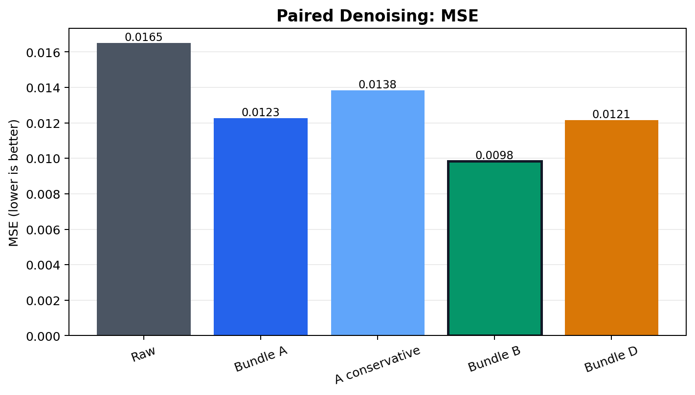
  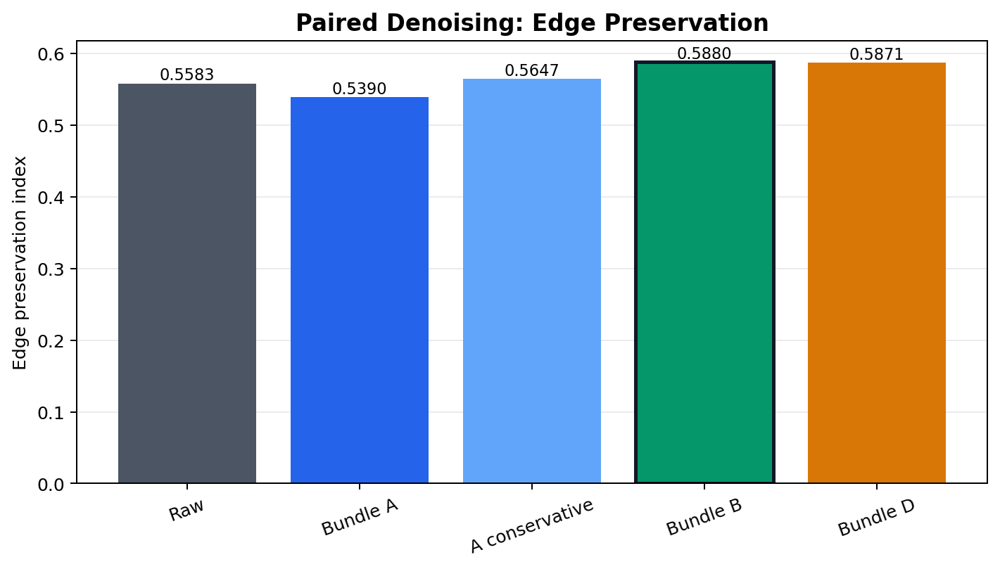
</p>

Takeaway: **Bundle B gives the strongest paired denoising metrics in the current public validation.** Bundle D is also useful as a structure-preserving candidate.

### B. Detector Compatibility: SSDD/HRSID Lightweight YOLO Sweep

Detector compatibility answers a different question: does this detector perform better after conditioning? In this setup, raw imagery remains strongest for the current lightweight YOLO detector baseline.

| Dataset | Current detector winner | Best mAP | Interpretation |
| --- | --- | ---: | --- |
| SSDD | Raw | 0.4894 | raw best matches this YOLO setup |
| HRSID | Raw | 0.6486 | raw best matches this YOLO setup |

<p align="center">
  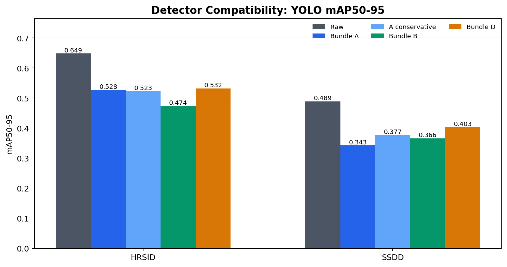
</p>

This does **not** mean denoising is useless. It means detector tuning and image-distribution shift matter. A detector trained or tuned on conditioned imagery could behave differently.

## How To Run

### Windows PowerShell

```powershell
git clone https://github.com/OmarNayyar/SAR-Level1-Conditioning.git
cd SAR-Level1-Conditioning

python -m venv .venv
.\.venv\Scripts\python.exe -m pip install --upgrade pip
.\.venv\Scripts\python.exe -m pip install -e ".[app,dev]"

.\.venv\Scripts\python.exe -m pytest -q
```

Launch the Streamlit app:

```powershell
.\.venv\Scripts\python.exe -m streamlit run apps\streamlit_app.py
```

Run a paired denoising evaluation if the Mendeley dataset is available locally:

```powershell
.\.venv\Scripts\python.exe scripts\evaluate_denoising_quality.py `
  --dataset mendeley `
  --input-root "data/raw/Mendeley SAR dataset" `
  --split val `
  --variants raw,bundle_a,bundle_a_conservative,bundle_b,bundle_d `
  --max-samples 20 `
  --output-root outputs/denoising_quality
```

Generate denoising panels:

```powershell
.\.venv\Scripts\python.exe scripts\make_denoising_panels.py `
  --output-root outputs\denoising_quality `
  --max-panels 12
```

Dry-run the final detector sweep before any heavy run:

```powershell
.\.venv\Scripts\python.exe scripts\run_final_sweep.py --dry-run
```

Only run the heavy detector sweep intentionally:

```powershell
.\.venv\Scripts\python.exe scripts\run_final_sweep.py
```

### Linux / macOS

```bash
git clone https://github.com/OmarNayyar/SAR-Level1-Conditioning.git
cd SAR-Level1-Conditioning

python3 -m venv .venv
./.venv/bin/python -m pip install --upgrade pip
./.venv/bin/python -m pip install -e ".[app,dev]"
./.venv/bin/python -m pytest -q
./.venv/bin/python -m streamlit run apps/streamlit_app.py
```

## Streamlit App

The app is a public-safe result browser and decision cockpit. It shows:

- project purpose and current conclusions;
- additive vs multiplicative SAR noise explanations;
- bundle routing and method tables;
- Mendeley denoising metrics and figures;
- SSDD/HRSID detector compatibility evidence;
- visual panel/gallery sections when local artifacts are present;
- graceful missing-artifact messages rather than accidental recomputation.

By default the app uses the public surface. A separate private/internal mode exists in code for controlled local handoff workflows, but the public GitHub repo is framed for public-data validation.

## Data

Raw datasets are **not committed**. This repo includes code, configs, tests, docs, lightweight public figures, and summary CSV/JSON files.

Expected Mendeley paired denoising structure:

```text
data/raw/Mendeley SAR dataset/
  GTruth/
  GTruth_val/
  Noisy/
  Noisy_val/
```

Sentinel-1 GRD/SLC utilities are included for optional sample search and future product-level validation. Credentials must be supplied through environment variables only; do not write credentials into configs.

## Repo Structure

```text
apps/                         Streamlit public result browser
configs/                      bundle, dataset, detector, and final-sweep configs
docs/                         public explanation, results, and release notes
results/public/               lightweight public summary tables and figures
scripts/                      CLI entrypoints for evaluation, bundles, figures, and checks
src/                          reusable Stage-1 conditioning and dataset code
tests/                        lightweight test suite
```

## What This Project Proves

- A practical Stage-1 SAR conditioning screening framework can be run reproducibly.
- Bundle B improves paired denoising metrics on Mendeley validation versus raw noisy input.
- Bundle D is a useful structure-preserving candidate.
- Detector compatibility can be evaluated separately from denoising quality.
- Raw remains the detector baseline for the current lightweight YOLO setup.

## What This Project Does Not Prove

- It does not prove that one universal SAR denoiser exists.
- It does not prove that denoising always improves detection or segmentation.
- It does not prove Bundle C/MERLIN performance without genuine complex SLC validation.
- It does not make claims for non-public operational data before representative products are tested.

## Next Steps

- Validate on representative real-world SAR products with known product level, mode, polarization, metadata, and downstream task.
- Add genuine SLC validation for Bundle C and MERLIN-style self-supervision.
- Tune or retrain detectors on conditioned imagery to test whether the detector/raw gap is distribution-driven.
- Add semantic segmentation benchmarks in addition to ship detection.

## References And Method Notes

The README intentionally keeps citations compact. See [docs/BUNDLE_METHOD_GUIDE.md](docs/BUNDLE_METHOD_GUIDE.md) and [docs/PDF_ALIGNMENT_AUDIT.md](docs/PDF_ALIGNMENT_AUDIT.md) for method-family mapping and original-brief alignment.

Relevant method families include Sentinel-1 thermal/noise-vector correction, Lee/refined Lee speckle filtering, MuLoG/BM3D-style log-domain despeckling, starlet sparse denoising, plug-and-play ADMM, MERLIN, and Speckle2Void.

## License

MIT License. See [LICENSE](LICENSE).
